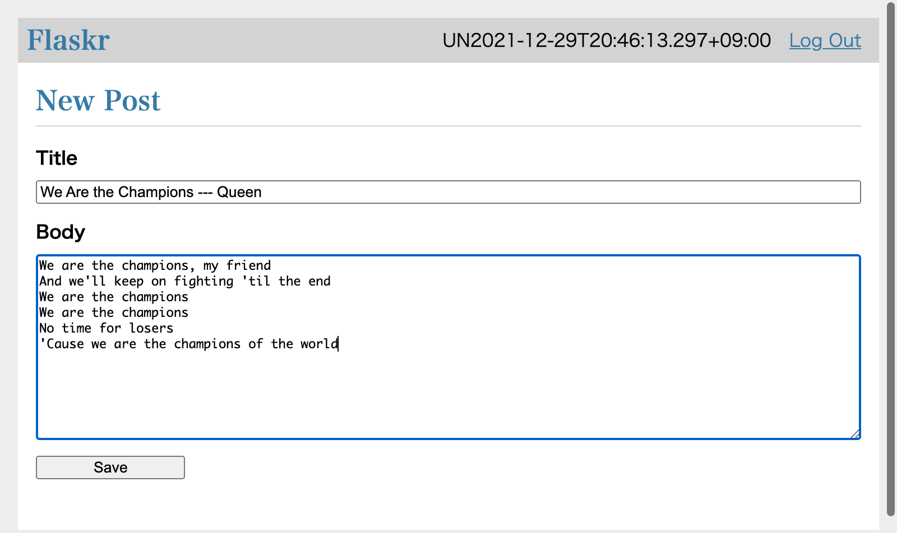

= Testing a Blog system with 2 Chrome browsers in Katalon Studio

== Background

I have a Web Application to test. It is a runninng sample code presented by 
https://flask.palletsprojects.com/en/2.0.x/tutorial/["Flask Tutorial"]. It is _a basic blog application called Flaskr. Users will be able to register, log in, create posts, and edit or delete their own posts._ I just typed in the sample codes as published without any changes. At first, let me go through the pages to grasp what it is. Later I will describe how to set it up on your own PC.

I open Chrome browser to visit http://127.0.0.1/ . I find the index page as follows, which has no blog posts submitted yet.

image:./docs/images/test_flaskr/1_start_from_here.png[1]

At first, I need to register a User for me before creating posts. I click the `Register` link. Then a form is presented where I am requested to type a credential (username and password pair).

image:./docs/images/test_flaskr/2_going_to_register_a_username.png[2]

I click the `Register` button. Then the user will be registered. I am transferred to the Login page.

image:./docs/images/test_flaskr/3_a_username_has_been_registered.png[3]

I re-type the credential (username and password) that I used to create my User.

image:./docs/images/test_flaskr/4_about_to_login.png[4]

I click the `Log In` button. Then I am transferred to the Index page. Please note that the username is displayed in the header. This implies that now I am logged into this blog application.

image:./docs/images/test_flaskr/5_the_user_have_logged_in.png[5]

Now I am going to create a new post. I click the `New` link. Then a empty form is displayed.

image:./docs/images/test_flaskr/6_opened_page_to_create_a_new_post.png[6]

I type texts into the `title` and `body` field.



I click the `Save` button. Then I am transferred to the index page. Please find a post has been saved into the Blob system and is now displayed in the list of posts.

image:./docs/images/test_flaskr/8_the_post_is_found_in_the_list.png[8]

== Problem to solve

You can easily imagine; I can create 2 or more users. So I should be able send multiple posts to http://127.0.0.1/ from 2 or more browsers simultaneously using 2 users each. When a user Alice made a post, then another user Bob should be able to see the post by Alice in an instant. When Bob made a new post, then soon Alice should be able to see the Bob's post.

This test scenario --- testing a web app with 2 browsers simultaneously --- is applicable to practical business. Let me assume I have a EC site which has dual user interface: Customer UI and Administrator UI. When a user submit an order to purchase some product, then an administrator should be able to see the order in the list of outstanding orders. I want to test both of the Customer UI and the Administrator UI. My Web UI test should submit an order in the Customer UI; then my test my test verify if the order is appearing in the Administrator UI. I want my test to simulate this dual-participants' interaction.

*But how can I do testing a web app with 2 browsers simultaneously in Katalon Studio?*

I can point out a problem : Katalon Studio's `WebUI.openBrowser()` keyword can not open 2 browsers.

I made link:Scripts/analysis/1_WebUI_openBrowser_twice/Script1640780797502.groovy[Test Cases/analysis/WebUI_openBrowser_twice] in Katalon Studio.

[source, groovy]
----
include::Scripts/analysis/1_WebUI_openBrowser_twice/Script1640780797502.groovy[]
----

This simple script calls `WebUI.openBrowser()` keyword twice. Will we see 2 windows of browsers opened? --- No. The 1st window opens but is closed by Katalon Studio before the 2nd window opens. 

image:./docs/images/analysis/1st_browser_is_closed_before_2nd.png[1st_browser_is_closed]

This is the way how the `WebUI.openBrowser()` is designed. You can not open 2 browses using this keyword.

== Solution

Behind the `WebUI.openBrowser()` and other `WebUI.xxx` keywords , https://www.browserstack.com/guide/selenium-webdriver-tutorial[Selenium WebDriver] is working. If I write a script that makes an instances of `WebDriver` class by calling `org.openwa.selenium.chrome.ChromeDriver` directly, then I can open a Chrome browser. My script can create 2 instances of `WebDriver` and keep them running. I will have 2 windows of Chrome browser and my test script can talk to them.

However, Katalon's `WebUI.xxx` keyword do not work with the browser (a `WebDriver` instance) that my script instantiated unless my script informs `WebUI.xxx` keywords of the `WebDriver` instance. Let me show you an experiment.

link:Scripts/analysis/2_WebUI_keywords_do_not_know/Script1640781667491.groovy[Test Cases/analysis/2_WebUI_keywords_do_not_know]

[source,groovy]
----
include::./Scripts/analysis/2_WebUI_keywords_do_not_know/Script1640781667491.groovy[lines=6..16]
----

This script opens a Chrome browser window by calling `new ChromeDriver()`. But the script does not inform Katalon Studio of the WebDriver instance. Therefore calling `WebUI.getWindowTitle()` keyword fails.

image:./docs/images/analysis/2_unable_to_get_title.png[]

How to fix this error? --- call `DriverFactory.changeWebDriver(WebDriver)`.

link:Scripts/analysis/3_how_to_inform_WebUI_keywords/Script1640781643037.groovy[TestCases/analysis/3_how_to_inform_WeebUUI_keywords]

[source, groovy]
----
include::./Scripts/analysis/3_how_to_inform_WebUI_keywords/Script1640781643037.groovy[]
----

This code passes. 

image:./docs/images/analysis/3_capable_to_get_title.png[capable]

Now `WebUI.xxx` keywords can interact with the browser which was created by my script using `new ChromeDriver()` API.


My script can open 2 browsers by calling `new ChromeDriver()` API. My script can call `DriverFactory.changeWebDriver(WebDriver)` API so that `WebUI.xxx` keywords can interact with the browser which was created by my script. These are the magic spell you should need to know.

== Description

How I could actually implement a set of Web UI test that targets the "Flaskr" blog system? --- I will show you a code set that runs here. The test code has the following characteristics.

1. I will start with a Test Case in plain-old Katalon Studio style. At first it looks trivial, but soon it gets large and complex as I implement more and more test cases.
2. I will introduce the [POM (Page Object Model)](https://www.guru99.com/page-object-model-pom-page-factory-in-selenium-ultimate-guide.html). POM makes my code set modularized.
3. Writing tests with POM requires good enough programmig skill. 

My code set is large and complex. I hope that people with sufficient programming skill in Java/Groovy would be able to read the source code and understand. I would describe about the essential points; I would not explain the code line-by-line.

=== Target Web App

== Envrionment setup

=== Installing docker command

I installed `docker` command into my Mac Book Air

```
$ brew install docker
...
```

I checked if the `docker` command is running.

```
$ docker --version
Docker version 20.10.2, build 2291f61
:~
$ 
```

Windows users can use "Docker Desktop on Windnows" of course,

* https://docs.docker.com/desktop/windows/install/


=== Starting up HTTP Server App at http://127.0.0.1/

I made a temporary directory with any name.
```
$ cd ~
$ mkdir flaskr
```

In the temp directory, I started a web app using a docker image.

```
$ cd ~/flaskr
$ docker run -it -p 80:8080 --rm kazurayam/flaskr-kazurayam:1.0.3
Serving on http://0.0.0.0:8080
```

Or, you can use the following shell script in the root directory of this project.

* link:./startup_flaskr.sh[startup_flaskr.sh]
[source,shell]
----
include::./startup_flaskr.sh[]
----


Now I can open a browser and visit the following URL.

* http://127.0.0.1:80/

image:docs/images/flaskr_just_started.png[]

I made a docker image which is publicly available at Docker Hub :

* https://hub.docker.com/repository/docker/kazurayam/flaskr-kazurayam

== Web UI Test Scenario

1. I will use *Flaskr* at `http://127.0.0.1` as a partner for me to develop a set of Web UI test scripts in Katalon Studio.

2. I will open 2 Chrome browsers. On each, I will visit the Flaskr site and interact with it. I will keep 2 browsers open and operate on them simultaneously.

3. On one browser, I will register a user *Alice* and make some posts.

4. On another browser, I will register another user *Bob* and make some posts.

5. Alice should be able to read the posts made by Bob. Bob should be able to read the posts made by Alice. My web ui test in Katalon Studio will check this conversation.

== Experiments
