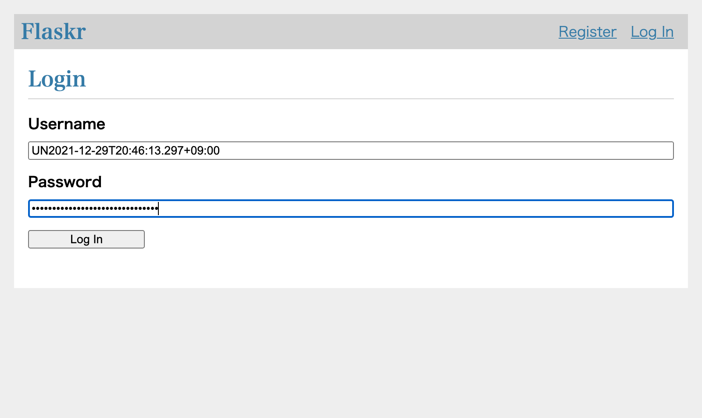
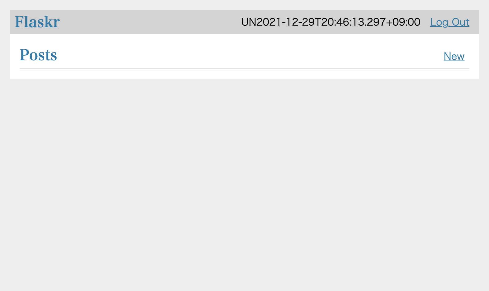
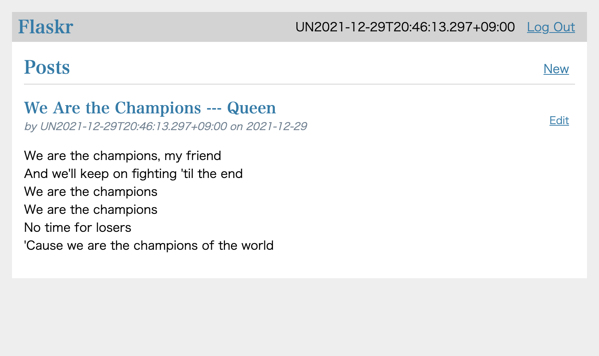

= Driving Multiple Browsers in Katalon Studio

== Background

I have a Web Application to test. It is the runninng sample code presented by 
https://flask.palletsprojects.com/en/2.0.x/tutorial/["Flask Tutorial"]. It is _a basic blog application called Flaskr. Users will be able to register, log in, create posts, and edit or delete their own posts._ I just typed in the sample codes as published without any changes. At first, let me go through the pages to grasp what it is.

I open Chrome browser to visit http://127.0.0.1/ 
(I will describe how to setup this web app on your PC later)

I saw the index page as follows, which has no blog posts submitted yet.

image:./docs/images/test_flaskr/1_start_from_here.png[]

At first, I needed to register a User for me before creating posts. I clicked the `Register` link. Then a form is preseted where I am requested to type a credential (username and password pair).

image:./docs/images/test_flaskr/2_going_to_register_a_username.png[]

I clicked the `Register` button. I am transferred to the LogIn page.


image:./docs/images/test_flaskr/3_a_username_has_been_registered.png[]

I re-type the credential (username and password) that I used to create my User.



I clicked the `Log In` button. Then I am transferred to the Index page. Please note that the username of mine is displayed in the header. This implies that I am logged-in the web application.



Now I am going to create a new post. I clicked the `New` link. Then a empty form is displayed.

image:./docs/images/test_flaskr/6_opened_page_to_create_a_new_post.png[]

I typed a text into the `title` field, and a text into the `body` field.

image:./docs/images/test_flaskr/7_has_typed_texts_into_a_post.png[]

I clicketd the `Save` button. Then I am transferred to the index page. Please find a post has been saved into the Blob system and is displayed in the list of posts.



== Problem to solve

You can imagine; we can create 2 or more users. We can send multiple posts to http://127.0.0.1/ from 2 or more browsers simultaneously.

*But how can I do it using Selenium-based Web UI automation tool? How can I do it inn Katalon Studio?*

== Solution

== Description

=== Target Web App

== Envrionment setup

=== Installing docker command

I installed `docker` command into my Mac Book Air

```
$ brew install docker
...
```

I checked if the `docker` command is running.

```
$ docker --version
Docker version 20.10.2, build 2291f61
:~
$ 
```

Windows users can use "Docker Desktop on Windnows" of course,

* https://docs.docker.com/desktop/windows/install/


=== Starting up HTTP Server App at http://127.0.0.1/

I made a temporary directory with any name.
```
$ cd ~
$ mkdir flaskr
```

In the temp directory, I started a web app using a docker image.

```
$ cd ~/flaskr
$ docker run -it -p 80:8080 --rm kazurayam/flaskr-kazurayam:1.0.3
Serving on http://0.0.0.0:8080
```

Or, you can use the following shell script in the root directory of this project.

* link:./startup_flaskr.sh[startup_flaskr.sh]
[source,shell]
----
include::./startup_flaskr.sh[]
----


Now I can open a browser and visit the following URL.

* http://127.0.0.1:80/

image:docs/images/flaskr_just_started.png[]

I made a docker image which is publicly available at Docker Hub :

* https://hub.docker.com/repository/docker/kazurayam/flaskr-kazurayam

== Web UI Test Scenario

1. I will use *Flaskr* at `http://127.0.0.1` as a partner for me to develop a set of Web UI test scripts in Katalon Studio.

2. I will open 2 Chrome browsers. On each, I will visit the Flaskr site and interact with it. I will keep 2 browsers open and operate on them simultaneously.

3. On one browser, I will register a user *Alice* and make some posts.

4. On another browser, I will register another user *Bob* and make some posts.

5. Alice should be able to read the posts made by Bob. Bob should be able to read the posts made by Alice. My web ui test in Katalon Studio will check this conversation.

== Experiments
