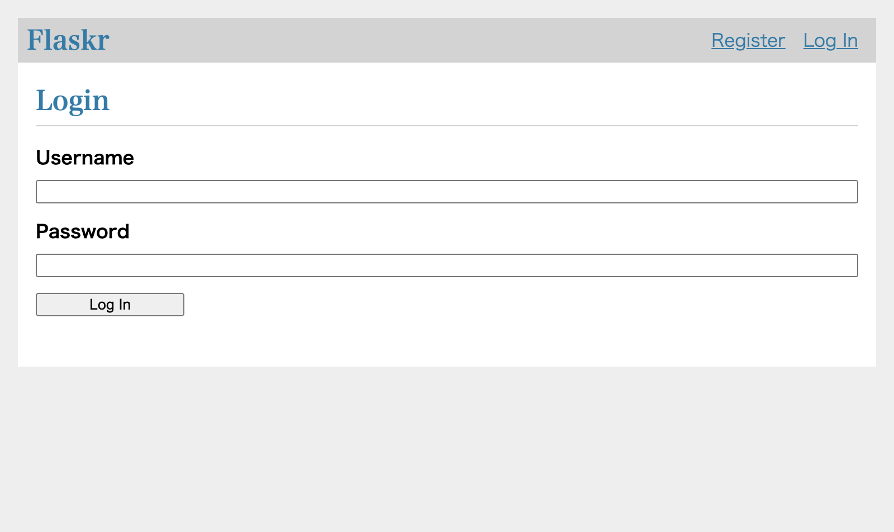

# Flaskr Test in Katalon Studio

> Back to [FlaskrTestInKatalonStudio repository](https://github.com/kazurayam/FlaskrTestInKatalonStudio)

Here I am going to explain what I have done to test a Blog app using 2 browser windows simultaneously. I used Katalon Studio. I wrote my test scripts in 2 ways; one in the typical Katalon Studio style, another using Page Object Model

This project is meant to be a set of sample codes for myself to develop a large scale test suite in future.

## Movie for demonstration

For those who don’t have time, please have a look at the following movie. This shows how my Web UI test works.

-   [Movie: Testing Falskr Blog app with 2 browser windows](https://drive.google.com/file/d/1p4IgsnHZQpw2xJs3EE4uf4aqFlQkZCYl/view?usp=sharing)

## Problem to solve

I want to answer to [a question](https://forum.katalon.com/t/using-webui-openbrowser-to-open-multiple-browsers-to-perform-actions-on-those-browser/8206) raised in the Katalon Forum with a runnable sample code set.

Please imagine. I can create 2 users to be authenticated by the web app. I would open 2 windows of Chrome browsers simultaneously. From each Chrome, I would visit the <http://127.0.0.1/> as 2 users each. When a user "Alice" made a post, then another user "Bob" should be able to see the post by Alice in an instant. When Bob made a new post, then soon Alice should be able to see the Bob’s post.

This test scenario --- testing a web app with 2 browsers simultaneously --- can be extended to business use cases. Suppose that I have an EC site which has dual user interface: Customer UI and Administrator UI. When a user submit an order to purchase some products, then an administrator should be able to see the order in the list of outstanding orders. I want to test both of the Customer UI and the Administrator UI at the same time. My Web UI test should simulate submitting an order in the Customer UI; then my test my test should verify if the order is appearing in the Administrator UI. I want my test to simulate such dual-participants' interaction.

**But how can I open 2 browsers simultaneously in Katalon Studio?**

There is a basic problem in Katalon Studio. Using `WebUI.openBrowser()` keyword, you can not open 2 browsers.

I made a Test Case [Test Cases/analysis/WebUI\_openBrowser\_twice](https://github.com/kazurayam/FlaskrTestInKatalonStudio/blob/master/Scripts/analysis/1_WebUI_openBrowser_twice/Script1640780797502.groovy) in Katalon Studio to demonstrate this problem.

    import com.kms.katalon.core.webui.keyword.WebUiBuiltInKeywords as WebUI

    WebUI.openBrowser("http://127.0.0.1/")
    WebUI.openBrowser("http://127.0.0.1/")

    WebUI.delay(1)
    WebUI.closeBrowser()

This simple script calls `WebUI.openBrowser()` keyword twice. Do we see 2 windows of browsers opened? --- No. The 1st window opens but is immediately closed by Katalon Studio before the 2nd window opens.

This way the `WebUI.openBrowser()` is designed. You can not open 2 browses using this keyword.

## Solution

### opening browsers by WebDriver API

Behind the `WebUI.openBrowser()` and other `WebUI.xxx` keywords , an instance of [Selenium WebDriver](https://www.browserstack.com/guide/selenium-webdriver-tutorial) is working. If I write a script that makes an instances of `WebDriver` class by calling `org.openwa.selenium.chrome.ChromeDriver` directly, then I can open a Chrome browser. My script can create 2 instances of `WebDriver` and keep them running. Then I will have 2 windows of Chrome browser. My test script can talk to them via the WebDriver API such as `driver.navigate().to("http://127.0.0.1/")`.

While opening browsers with WebDriver API, still I want to use `WebUI.xxx` keywords. There is a pitfall. Katalon’s `WebUI.xxx` keyword do not work with a browser (a `WebDriver` instance) that my script instantiated. Let me show you an experiment.

[Test Cases/analysis/2\_WebUI\_keywords\_do\_not\_know](https://github.com/kazurayam/FlaskrTestInKatalonStudio/blob/master/Scripts/analysis/2_WebUI_keywords_do_not_know/Script1640781667491.groovy)

    String chrome_executable_path = DriverFactory.getChromeDriverPath()
    System.setProperty('webdriver.chrome.driver', chrome_executable_path)

    WebDriver browser = new ChromeDriver()
    browser.navigate().to('http://127.0.0.1/')

    // WebUI.xxx do not know the WebDriver instance created here

    String windowTitle = WebUI.getWindowTitle()
    assert "Posts - Flaskr" == windowTitle

This script opens a Chrome browser window by calling `new ChromeDriver()`. But the script does not inform Katalon Studio of the WebDriver instance. WebUI keywords are not aware of the browser. Therefore calling `WebUI.getWindowTitle()` keyword fails.

### informing Katalon Studio of browsers opened by WebDriver API

How to fix this error? --- call `DriverFactory.changeWebDriver(WebDriver browser)`.

[TestCases/analysis/3\_how\_to\_inform\_WeebUUI\_keywords](https://github.com/kazurayam/FlaskrTestInKatalonStudio/blob/master/Scripts/analysis/3_how_to_inform_WebUI_keywords/Script1640781643037.groovy)

    import org.openqa.selenium.WebDriver
    import org.openqa.selenium.chrome.ChromeDriver

    import com.kms.katalon.core.webui.driver.DriverFactory
    import com.kms.katalon.core.webui.keyword.WebUiBuiltInKeywords as WebUI

    String chrome_executable_path = DriverFactory.getChromeDriverPath()
    System.setProperty('webdriver.chrome.driver', chrome_executable_path)

    WebDriver browser = new ChromeDriver()
    browser.navigate().to('http://127.0.0.1/')

    // i can let WebUI.xxx keywords know the WebDriver instance created by my script
    DriverFactory.changeWebDriver(browser)

    String windowTitle = WebUI.getWindowTitle()
    assert "Posts - Flaskr" == windowTitle

This code passes.

Now `WebUI.xxx` keywords can interact with the browser which was created by my script using `new ChromeDriver()` API.

### Magic spells for opening 2 browsers

In short, the following is the magic spells you need to know.

1.  In Katalon Studio, test script can open 2 browsers by calling `new ChromeDriver()` API twice.

2.  a test script can call `DriverFactory.changeWebDriver(WebDriver)` API so that `WebUI.xxx` keywords can interact with the browser which was created by the script.

## Application Under Test at a glance

I will use a Web Application named "Flaskr" as a test bed. Flaskr is the sample code presented by
["Flask Tutorial"](https://flask.palletsprojects.com/en/2.0.x/tutorial/). It is

> a basic blog application called Flaskr. Users will be able to register, log in, create posts, and edit or delete their own posts.

I just typed the sample codes as published without any changes, and made a docker image. Later I will describe how to run it on your local PC. Let me go through the screenshots of Flarkr to see what it is.

I open Chrome browser to visit the URL of the Application Under Test:

-   <http://127.0.0.1/>

I find the index page as follows, which has no blog posts submitted yet.

At first, I need to register a User for me before creating posts. I click the `Register` link. Then a form is presented where I am requested to type a credential (username and password pair).

I click the `Register` button. Then the user will be registered. I am transferred to the Login page.

I re-type the credential (username and password) that I used to create my User.

I click the `Log In` button. Then I am transferred to the Index page. Please note that the username is displayed in the header. This implies that now I am logged into this blog application.

Now I am going to create a new post. I click the `New` link. Then a empty form is displayed.

I type texts into the `title` and `body` field.

I click the `Save` button. Then I am transferred to the index page. Please find a post has been saved into the Blob system and is now displayed in the list of posts.

## Solution described

### Installing docker command

You need the `docker` command on your own PC. I installed `docker` command into my Mac Book Air using Homebrew.

    $ brew install docker

I checked if the `docker` command is operational.

    $ docker --version
    Docker version 20.10.2, build 2291f61
    :~
    $

Windows users can use "Docker Desktop on Windows",

-   <https://docs.docker.com/desktop/windows/install/>

### Starting up Flaskr server at <http://127.0.0.1/>

You need a temporary directory with any name.

    $ cd ~
    $ mkdir flaskr

In the temp directory, you want to execute the `docker run` command:

    $ cd ~/flaskr
    $ docker run -it -p 80:8080 --rm kazurayam/flaskr-kazurayam:1.0.3
    Serving on http://0.0.0.0:8080

Or, you can use the following shell script in the root directory of this project.

-   [startup\_flaskr.sh](https://github.com/kazurayam/FlaskrTestInKatalonStudio/blob/master/startup_flaskr.sh)

<!-- -->

    if [ ! -e ./tmp ]; then
        mkdir tmp
    fi 
    cd ./tmp
    docker run -it -p 80:8080 --rm kazurayam/flaskr-kazurayam:1.0.3
    cd -

Now I can open a browser and visit the following URL.

-   <http://127.0.0.1:80/>

You can stop the HTTP server by CTRL+C.

Flaskr has an internal database where user credentials and posts are persisted. When Flaskr is stopped and re-started, it clears the database to the initial state.

### Flaskr docker image

I made a docker image which is publicly available at Docker Hub :

-   <https://hub.docker.com/repository/docker/kazurayam/flaskr-kazurayam>

See [MyPythonProjectTemplate](https://github.com/kazurayam/MyPythonProjectTemplate) (japanese only) how I created this docker image.

## Description of codes

### Test Cases/flaskr/TC1\_open\_close

-   [flaskr/TC1\_open\_close](https://github.com/kazurayam/FlaskrTestInKatalonStudio/blob/master/Scripts/flaskr/TC1_open_close/Script1640905753444.groovy)

This script opens a Chrome browser using Katalon Studio’s built-in keyword `WebUI.openBrowser`. It navigates to a URL, verifies if the loaded page is the one expected. This is a typical/simplest test script in Katalon Studio.

    import static com.kms.katalon.core.testobject.ObjectRepository.findTestObject

    import com.kms.katalon.core.webui.keyword.WebUiBuiltInKeywords as WebUI

    WebUI.openBrowser('')
    WebUI.navigateToUrl('http://127.0.0.1/')

    WebUI.verifyElementPresent(findTestObject("blog/IndexPage/h1_flaskr"), 10)
    WebUI.verifyElementPresent(findTestObject("blog/IndexPage/a_Register"), 3)
    WebUI.verifyElementPresent(findTestObject("blog/IndexPage/a_Log In"), 3)

    WebUI.delay(1)

    WebUI.closeBrowser()

### Test Cases/flaskr/TC2\_register\_Alice\_then\_LogIn

-   [flaskr/TC2\_register\_Alice\_the\_Login](https://github.com/kazurayam/FlaskrTestInKatalonStudio/blob/master/Scripts/flaskr/TC2_register_Alice_then_LogIn/Script1640905753448.groovy)

This script does a bit more than `TC1_openn_close`. It interacts with the "Flaskr" web app.

1.  It opens a Chrome browser usig Katalon keyword `WebUI.openBrowser()` and navigate to the Flarkr URL.

2.  It registers a new user "Alice".

3.  It logs in the Flaskr app using the user "Alice".

<!-- -->

    import static com.kms.katalon.core.testobject.ObjectRepository.findTestObject

    import com.kms.katalon.core.util.KeywordUtil
    import com.kms.katalon.core.webui.keyword.WebUiBuiltInKeywords as WebUI

    String username = 'Alice'
    String password = 'ThisIsNotAPassword'

    WebUI.openBrowser('')
    WebUI.navigateToUrl('http://127.0.0.1/')

    // ensure we are on the index page
    WebUI.verifyElementPresent(findTestObject("blog/IndexPage/h1_flaskr"), 10)
    WebUI.verifyElementPresent(findTestObject("blog/IndexPage/a_Register"), 3)
    WebUI.verifyElementPresent(findTestObject("blog/IndexPage/a_Log In"), 3)

    // we want to navigate to the Register page
    WebUI.click(findTestObject("blog/IndexPage/a_Register"))

    // make sure we are on the Register page
    WebUI.verifyElementPresent(findTestObject("auth/RegisterCredentialPage/input_Register"), 3)

    // we want to register a user
    WebUI.setText(findTestObject("auth/RegisterCredentialPage/input_username"), username)
    WebUI.setText(findTestObject("auth/RegisterCredentialPage/input_password"), password)
    WebUI.click(findTestObject("auth/RegisterCredentialPage/input_Register"))

    // check if the user is already registered
    boolean alreadyRegistered = WebUI.waitForElementPresent(findTestObject("auth/RegisterCredentialPage/div_flash"), 3)
    if (alreadyRegistered) {
        KeywordUtil.markWarning("usernamee ${username} is already registered.")
        // we are still on the Register page
        // so we want to navigate to the Log In page
        WebUI.click(findTestObject("auth/RegisterCredentialPage/a_Log In"))
    }

    // now we are on the Login page
    // now let us log in
    WebUI.verifyElementPresent(findTestObject("auth/LogInPage/input_Log In"), 3)
    WebUI.setText(findTestObject("auth/LogInPage/input_username"), username)
    WebUI.setText(findTestObject("auth/LogInPage/input_password"), password)
    WebUI.click(findTestObject("auth/LogInPage/input_Log In"))

    // now we should be are on the index page
    // have I successfully logged in?
    WebUI.verifyElementPresent(findTestObject("blog/IndexPage/nav_span_username", ["username": username]), 3)

    WebUI.closeBrowser()

### Test Cases/flaskr/TC3\_Alice\_and\_Bob\_interact

-   [flaskr/TC3\_Alice\_and\_Bob\_interact](https://github.com/kazurayam/FlaskrTestInKatalonStudio/blob/master/Scripts/flaskr/TC3_Alice_and_Bob_interact/Script1640905753452.groovy)

This script is coded in the typical style of Katalon Studio’s test case.

This script demonstrates how to perform a Web UI test using 2 browsers in Katalon Studio.

1.  This script opens 2 windows of Chrome browser.

2.  It interacts with Flaskr app as 2 users "Alice" and "Bob" through each 2 windows.

3.  Alice logs in Flaskr, makes a post. The post shows a lyrics of a famous song.

4.  Bob logs in Flaskr, makes a post. The post shows a lyrics of another famous song.

5.  *Alice checks if she finds a post made by Bob in the list of posts in Flaskr.*

6.  *Bob checks if he finds a post mode by Alice.*

This script introduces Groovy functions (e.g, `def login()`) in order to reduce code duplications.

### Test Cases/POM/TC4\_Alice\_and\_Bob\_interact\_POM

-   [POM/TC4\_Alice\_and\_Bob\_interace\_POM](https://github.com/kazurayam/FlaskrTestInKatalonStudio/blob/master/Scripts/POM/TC4_Alice_and_Bob_interact_POM/Script1640905732532.groovy)

This script does exactly the same as [flaskr/TC3\_Alice\_and\_Bob\_interact](https://github.com/kazurayam/FlaskrTestInKatalonStudio/blob/master/Scripts/flaskr/TC3_Alice_and_Bob_interact/Script1640905753452.groovy). But the code looks quite different. It employs the design pattern [Page Object model](https://www.guru99.com/page-object-model-pom-page-factory-in-selenium-ultimate-guide.html).

    import org.openqa.selenium.Dimension
    import org.openqa.selenium.Point
    import org.openqa.selenium.WebDriver
    import org.openqa.selenium.chrome.ChromeDriver

    import com.kms.katalon.core.util.KeywordUtil
    import com.kms.katalon.core.webui.driver.DriverFactory
    import com.kms.katalon.core.webui.keyword.WebUiBuiltInKeywords as WebUI

    import flaskrtest.data.Song
    import flaskrtest.data.Songs
    import flaskrtest.pages.auth.LogInPage
    import flaskrtest.pages.auth.RegisterCredentialPage
    import flaskrtest.pages.blog.CreatePostPage
    import flaskrtest.pages.blog.IndexPage
    import flaskrtest.pages.blog.Post

    // preparation for ChromeDriver
    String chrome_executable_path = DriverFactory.getChromeDriverPath()
    System.setProperty('webdriver.chrome.driver', chrome_executable_path)

    // open a Chome browser for Alice
    WebDriver browser0 = new ChromeDriver()
    layoutWindow(browser0, new Dimension(720, 800), new Point(0, 0))

    // open a Chrome browser for Bob
    WebDriver browser1 = new ChromeDriver()
    layoutWindow(browser1, new Dimension(720, 800), new Point(720, 0))

    // Alice logs in
    login(browser0, "Alice", "AliceInTheWonderLand")

    // Bob logs in
    login(browser1, "Bob", "LikeARollingStone")

    Song song_of_miyuki = Songs.get(0)
    Song song_of_queen  = Songs.get(1)

    // Alice makes a post
    post(browser0, "Alice", song_of_miyuki)

    // Bob makes a post
    post(browser1, "Bob", song_of_queen)

    // ensure Alice finds the song that Bob posted
    finds(browser0, "Alice", "Bob", song_of_queen)

    // ensure Bob finds the song that Alice posted
    finds(browser1, "Bob", "Alic", song_of_miyuki)

    WebUI.delay(1)

    // close 2 browsers
    browser0.quit()
    browser1.quit()

    /**
     * 
     * @param browser
     * @param username
     * @param password
     * @return
     */
    def login(WebDriver browser, String username, String password) {
        // let's start playing on the Flaskr web app
        IndexPage index_page = new IndexPage(browser)
        index_page.load()
        
        // ensuree we are on the index page
        assert index_page.app_header_exists()
        assert index_page.register_anchor_exists()
        assert index_page.login_anchor_exists()
        assert index_page.posts_header_exists()
            
        // we want to navigate to thee Register page
        index_page.open_register_page()
        RegisterCredentialPage register_credential_page = new RegisterCredentialPage(browser)
        
        // make sure we are o the Register page
        assert register_credential_page.register_button_exists()
        
        // we want to register a user
        register_credential_page.type_username(username)
        register_credential_page.type_password(password)
        register_credential_page.do_register()
        
        // check if the user is already registered
        boolean alreadyRegistered = register_credential_page.flash_exists()
        if (alreadyRegistered) {
            KeywordUtil.markWarning("usernamee ${username} is already registered.")
            // we are still on the Register page
            // so we want to navigate to the Log In page
            register_credential_page.do_login()
        }
        
        // - now we are transferred to the Login page
        LogInPage login_page = new LogInPage(browser)
        assert login_page.login_button_exists()
        
        // Login with the added credential
        // - type credentials and do login
        login_page.type_username(username)
        login_page.type_password(password)
        login_page.do_login()
        
        // - make sure we are on the index page
        assert index_page.posts_header_exists()
    }

    /**
     * 
     * @param browser
     * @param usernname
     * @param song
     * @return
     */
    def post(WebDriver browser, String username, Song song) {
        DriverFactory.changeWebDriver(browser)
        // let's start from the index page
        IndexPage index_page = new IndexPage(browser)
        index_page.load()
        
        // we want to navigate to the CreatePost page
        index_page.open_create_post_page()
        CreatePostPage create_post_page = new CreatePostPage(browser)
        assert create_post_page.save_button_exists()
        
        // type title
        String title = song.title + " --- " + song.by
        create_post_page.type_title(title)
        // type body
        String lyric = song.lyric
        create_post_page.type_body(lyric)
        // save the post
        create_post_page.do_save()
        
        // now we are on the index page
        // make sure that the 1st article is the song just posted by usernname
        Post post = index_page.get_post_latest()
        assert post != null
        assert post.get_title() == title
        assert post.about_text_contains(username)
        assert post.get_body() == lyric
    }

    def finds(WebDriver browser, String username, String somebody, Song song) {
        DriverFactory.changeWebDriver(browser)
        // let's start from the index page
        IndexPage index_page = new IndexPage(browser)
        index_page.load()
        // find a post by somebody
        List<Post> postsBySomebody = index_page.get_posts_by(somebody)
        assert postsBySomebody.size() > 0
    }

    /**
     *
     * @param browser
     * @param dimension
     * @param point
     * @return
     */
    def layoutWindow(WebDriver browser, Dimension dimension, Point point) {
        browser.manage().window().setSize(dimension)
        browser.manage().window().setPosition(point)
    }

For me, the source code of [POM/TC4\_Alice\_and\_Bob\_interact\_POM](https://github.com/kazurayam/FlaskrTestInKatalonStudio/blob/master/Scripts/POM/TC4_Alice_and_Bob_interact_POM/Script1640905732532.groovy) with POM is far easier to understand/maintain/extend than [flaskr/TC3\_Alice\_and\_Bob\_interact](https://github.com/kazurayam/FlaskrTestInKatalonStudio/blob/master/Scripts/flaskr/TC3_Alice_and_Bob_interact/Script1640905753452.groovy).

## Appendix

### Asciidoc → Markdown

I wrote the source of this document in [Asciidoc](https://asciidoc-py.github.io/index.html) format, then convert it into Markdown format using [asciidoctor](https://asciidoctor.org/) and [pandoc](https://pandoc.org/).

Asciidoc enabled me to automatically include the latest source codes into the document. No manual copy & paste operation is required. This made may document authoring work productive.

I used a shell script [indexconv.sh](https://github.com/kazurayam/FlaskrTestInKatalonStudio/blob/master/docs/indexconv.sh) to adoc to md conversion. This script was originally shared at <https://github.com/github/markup/issues/1095>
