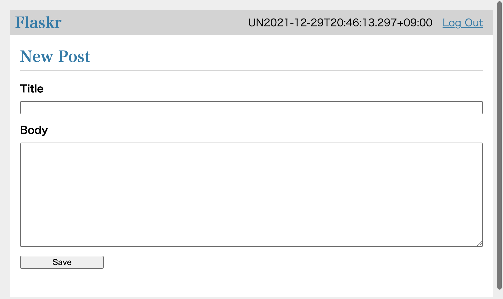

= Flaskr Test in Katalon Studio

____
Back to link:https://github.com/kazurayam/FlaskrTestInKatalonStudio[FlaskrTestInKatalonStudio repository]
____

Here I am going to explain what I have done to test a Blog app using 2 browser windows simultaneously. I used Katalon Studio. I wrote my test scripts in 2 ways; one in the typical Katalon Studio style, another using Page Object Model

This project is meant to be [underline]#a set of sample codes for myself to develop a large scale test suite in future#.

== Movie for demonstration

For those who don't have time, please have a look at the following movie. This shows how my Web UI test works.

* https://drive.google.com/file/d/1p4IgsnHZQpw2xJs3EE4uf4aqFlQkZCYl/view?usp=sharing[Movie: Testing Falskr Blog app with 2 browser windows]

== Problem to solve

I want to answer to https://forum.katalon.com/t/using-webui-openbrowser-to-open-multiple-browsers-to-perform-actions-on-those-browser/8206[a question] raised in the Katalon Forum with a runnable sample code set.

Please imagine. I can create 2 users to be authenticated by the web app. I would open 2 windows of Chrome browsers simultaneously. From each Chrome, I would visit the http://127.0.0.1/ as 2 users each. When a user "Alice" made a post, then another user "Bob" should be able to see the post by Alice in an instant. When Bob made a new post, then soon Alice should be able to see the Bob's post.

This test scenario --- testing a web app with 2 browsers simultaneously --- can be extended to business use cases. Suppose that I have an EC site which has dual user interface: Customer UI and Administrator UI. When a user submit an order to purchase some products, then an administrator should be able to see the order in the list of outstanding orders. I want to test both of the Customer UI and the Administrator UI at the same time. My Web UI test should simulate submitting an order in the Customer UI; then my test my test should verify if the order is appearing in the Administrator UI. I want my test to simulate such dual-participants' interaction.

*But how can I open 2 browsers simultaneously in Katalon Studio?*

There is a basic problem in Katalon Studio. Using `WebUI.openBrowser()` keyword, you can not open 2 browsers.

I made a Test Case link:https://github.com/kazurayam/FlaskrTestInKatalonStudio/blob/master/Scripts/analysis/1_WebUI_openBrowser_twice/Script1640780797502.groovy[Test Cases/analysis/WebUI_openBrowser_twice] in Katalon Studio to demonstrate this problem.

[source, groovy]
----
include::../Scripts/analysis/1_WebUI_openBrowser_twice/Script1640780797502.groovy[]
----

This simple script calls `WebUI.openBrowser()` keyword twice. Do we see 2 windows of browsers opened? --- No. The 1st window opens but is immediately closed by Katalon Studio before the 2nd window opens. 


This way the `WebUI.openBrowser()` is designed. You can not open 2 browses using this keyword.

== Solution

=== opening browsers by WebDriver API

Behind the `WebUI.openBrowser()` and other `WebUI.xxx` keywords , an instance of https://www.browserstack.com/guide/selenium-webdriver-tutorial[Selenium WebDriver] is working. If I write a script that makes an instances of `WebDriver` class by calling `org.openwa.selenium.chrome.ChromeDriver` directly, then I can open a Chrome browser. My script can create 2 instances of `WebDriver` and keep them running. Then I will have 2 windows of Chrome browser. My test script can talk to them via the WebDriver API such as `driver.navigate().to("http://127.0.0.1/")`.

While opening browsers with WebDriver API, still I want to use `WebUI.xxx` keywords. There is a pitfall. Katalon's `WebUI.xxx` keyword do not work with a browser (a `WebDriver` instance) that my script instantiated. Let me show you an experiment.

link:https://github.com/kazurayam/FlaskrTestInKatalonStudio/blob/master/Scripts/analysis/2_WebUI_keywords_do_not_know/Script1640781667491.groovy[Test Cases/analysis/2_WebUI_keywords_do_not_know]

[source,groovy]
----
include::../Scripts/analysis/2_WebUI_keywords_do_not_know/Script1640781667491.groovy[lines=6..16]
----

This script opens a Chrome browser window by calling `new ChromeDriver()`. But the script does not inform Katalon Studio of the WebDriver instance. WebUI keywords are not aware of the browser. Therefore calling `WebUI.getWindowTitle()` keyword fails.

image:./images/analysis/2_unable_to_get_title.png[]

=== informing Katalon Studio of browsers opened by WebDriver API

How to fix this error? --- call `DriverFactory.changeWebDriver(WebDriver browser)`.

link:https://github.com/kazurayam/FlaskrTestInKatalonStudio/blob/master/Scripts/analysis/3_how_to_inform_WebUI_keywords/Script1640781643037.groovy[TestCases/analysis/3_how_to_inform_WeebUUI_keywords]

[source, groovy]
----
include::../Scripts/analysis/3_how_to_inform_WebUI_keywords/Script1640781643037.groovy[]
----

This code passes.

image:./images/analysis/3_capable_to_get_title.png[capable]

Now `WebUI.xxx` keywords can interact with the browser which was created by my script using `new ChromeDriver()` API.

=== Magic spells for opening 2 browsers

In short, the following is the magic spells you need to know.

1. In Katalon Studio, test script can open 2 browsers by calling `new ChromeDriver()` API twice.

2. a test script can call `DriverFactory.changeWebDriver(WebDriver)` API so that `WebUI.xxx` keywords can interact with the browser which was created by the script. 

== Application Under Test at a glance

I will use a Web Application named "Flaskr" as a test bed. Flaskr is the sample code presented by 
https://flask.palletsprojects.com/en/2.0.x/tutorial/["Flask Tutorial"]. It is 

____
a basic blog application called Flaskr. Users will be able to register, log in, create posts, and edit or delete their own posts.
____

I just typed the sample codes as published without any changes, and made a docker image. Later I will describe how to run it on your local PC. Let me go through the screenshots of Flarkr to see what it is.

I open Chrome browser to visit the URL of the Application Under Test: 

* http://127.0.0.1/

I find the index page as follows, which has no blog posts submitted yet.

image:./images/test_flaskr/1_start_from_here.png[1]

At first, I need to register a User for me before creating posts. I click the `Register` link. Then a form is presented where I am requested to type a credential (username and password pair).

image:./images/test_flaskr/2_going_to_register_a_username.png[2]

I click the `Register` button. Then the user will be registered. I am transferred to the Login page.

image:./images/test_flaskr/3_a_username_has_been_registered.png[3]

I re-type the credential (username and password) that I used to create my User.

image:./images/test_flaskr/4_about_to_login.png[4]

I click the `Log In` button. Then I am transferred to the Index page. Please note that the username is displayed in the header. This implies that now I am logged into this blog application.

image:./images/test_flaskr/5_the_user_have_logged_in.png[5]

Now I am going to create a new post. I click the `New` link. Then a empty form is displayed.



I type texts into the `title` and `body` field.

image:./images/test_flaskr/7_has_typed_texts_into_a_post.png[7]

I click the `Save` button. Then I am transferred to the index page. Please find a post has been saved into the Blob system and is now displayed in the list of posts.

image:./images/test_flaskr/8_the_post_is_found_in_the_list.png[8]

== Solution described

=== Installing docker command

You need the `docker` command on your own PC. I installed `docker` command into my Mac Book Air using Homebrew.

```
$ brew install docker
```

I checked if the `docker` command is operational.

```
$ docker --version
Docker version 20.10.2, build 2291f61
:~
$ 
```

Windows users can use "Docker Desktop on Windows",

* https://docs.docker.com/desktop/windows/install/


=== Starting up Flaskr server at http://127.0.0.1/

You need a temporary directory with any name.
```
$ cd ~
$ mkdir flaskr
```

In the temp directory, you want to execute the `docker run` command:

```
$ cd ~/flaskr
$ docker run -it -p 80:8080 --rm kazurayam/flaskr-kazurayam:1.0.3
Serving on http://0.0.0.0:8080
```

Or, you can use the following shell script in the root directory of this project.

* link:https://github.com/kazurayam/FlaskrTestInKatalonStudio/blob/master/startup_flaskr.sh[startup_flaskr.sh]
[source,shell]
----
include::../startup_flaskr.sh[]
----


Now I can open a browser and visit the following URL.

* http://127.0.0.1:80/

You can stop the HTTP server by CTRL+C.

Flaskr has an internal database where user credentials and posts are persisted. When Flaskr is stopped and re-started, it clears the database to the initial state. 

=== Flaskr docker image

I made a docker image which is publicly available at Docker Hub :

* https://hub.docker.com/repository/docker/kazurayam/flaskr-kazurayam

See https://github.com/kazurayam/MyPythonProjectTemplate[MyPythonProjectTemplate] (japanese only) how I created this docker image.

== Description of codes

=== Test Cases/flaskr/TC1_open_close

* link:https://github.com/kazurayam/FlaskrTestInKatalonStudio/blob/master/Scripts/flaskr/TC1_open_close/Script1640905753444.groovy[flaskr/TC1_open_close]

This script opens a Chrome browser using Katalon Studio's built-in keyword `WebUI.openBrowser`. It navigates to a URL, verifies if the loaded page is the one expected. This is a typical/simplest test script in Katalon Studio.

[source, groovy]
----
include::../Scripts/flaskr/TC1_open_close/Script1640905753444.groovy[]
----

=== Test Cases/flaskr/TC2_register_Alice_then_LogIn

* link:https://github.com/kazurayam/FlaskrTestInKatalonStudio/blob/master/Scripts/flaskr/TC2_register_Alice_then_LogIn/Script1640905753448.groovy[flaskr/TC2_register_Alice_the_Login]

This script does a bit more than `TC1_openn_close`. It interacts with the "Flaskr" web app.

1. It opens a Chrome browser usig Katalon keyword `WebUI.openBrowser()` and navigate to the Flarkr URL.
2. It registers a new user "Alice".
3. It logs in the Flaskr app using the user "Alice".

[source, groovy]
----
include::../Scripts/flaskr/TC2_register_Alice_then_LogIn/Script1640905753448.groovy[]
----

=== Test Cases/flaskr/TC3_Alice_and_Bob_interact

* link:https://github.com/kazurayam/FlaskrTestInKatalonStudio/blob/master/Scripts/flaskr/TC3_Alice_and_Bob_interact/Script1640905753452.groovy[flaskr/TC3_Alice_and_Bob_interact]

This script is coded in the typical style of Katalon Studio's test case.

This script demonstrates how to perform a Web UI test using 2 browsers in Katalon Studio.

1. This script opens 2 windows of Chrome browser.
2. It interacts with Flaskr app as 2 users "Alice" and "Bob" through each 2 windows.
3. Alice logs in Flaskr, makes a post. The post shows a lyrics of a famous song.
4. Bob logs in Flaskr, makes a post. The post shows a lyrics of another famous song.
5. _Alice checks if she finds a post made by Bob in the list of posts in Flaskr._
6. _Bob checks if he finds a post mode by Alice._

This script introduces Groovy functions (e.g, `def login()`) in order to reduce code duplications.

=== Test Cases/POM/TC4_Alice_and_Bob_interact_POM

* link:https://github.com/kazurayam/FlaskrTestInKatalonStudio/blob/master/Scripts/POM/TC4_Alice_and_Bob_interact_POM/Script1640905732532.groovy[POM/TC4_Alice_and_Bob_interace_POM]

This script does exactly the same as link:https://github.com/kazurayam/FlaskrTestInKatalonStudio/blob/master/Scripts/flaskr/TC3_Alice_and_Bob_interact/Script1640905753452.groovy[flaskr/TC3_Alice_and_Bob_interact]. But the code looks quite different. It employs the design pattern https://www.guru99.com/page-object-model-pom-page-factory-in-selenium-ultimate-guide.html[Page Object model].

[source, groovy]
----
include::../Scripts/POM/TC4_Alice_and_Bob_interact_POM/Script1640905732532.groovy[]
----


For me, the source code of link:https://github.com/kazurayam/FlaskrTestInKatalonStudio/blob/master/Scripts/POM/TC4_Alice_and_Bob_interact_POM/Script1640905732532.groovy[POM/TC4_Alice_and_Bob_interact_POM] with POM is far easier to understand/maintain/extend than link:https://github.com/kazurayam/FlaskrTestInKatalonStudio/blob/master/Scripts/flaskr/TC3_Alice_and_Bob_interact/Script1640905753452.groovy[flaskr/TC3_Alice_and_Bob_interact].

== Appendix

=== Asciidoc -> Markdown

I wrote the source of this document in https://asciidoc-py.github.io/index.html[Asciidoc] format, then convert it into Markdown format using https://asciidoctor.org/[asciidoctor] and https://pandoc.org/[pandoc]. 

Asciidoc enabled me to automatically include the latest source codes into the document. No manual copy & paste operation is required. This made may document authoring work productive.

I used a shell script link:https://github.com/kazurayam/FlaskrTestInKatalonStudio/blob/master/docs/indexconv.sh[indexconv.sh] to adoc to md conversion. This script was originally shared at https://github.com/github/markup/issues/1095 
